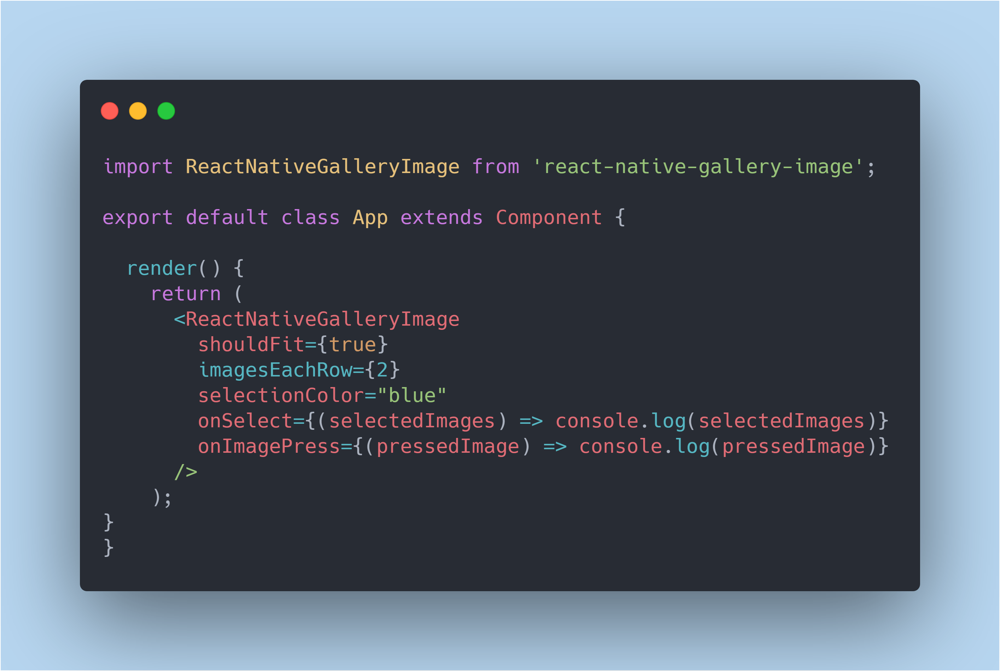

# React Native Gallery Image


## Preview

Layout doesn't break on rotate            |  Selecting images
:-------------------------:|:-------------------------:
  |  

## installation

You can install this package with the following command:

`yarn add react-native-gallery-image`

or

`npm install react-native-gallery-image`


### In the top level component add

```
import ReactNativeGalleryImage from 'react-native-gallery-image';

export default class App extends Component {

  render() {
    return (
      <ReactNativeGalleryImage
        shouldFit={true}
        imagesEachRow={2}
        selectionColor="blue"
        onSelect={(selectedImages) => console.log(selectedImages)}
        onImagePress={(pressedImage) => console.log(pressedImage)}
      />
    );
}
}
```

### Props

| Props          | Type        | Notes                                                                                      | Required | Default  |
| --------       | ----------- | ------------------------------------------------------------------------------------------ | -------- | -------- |
| images         | `Array`     | Array of images                                                                            | ✔️       |          |
| imagesEachRow  | `Number`    | Number of images needed in one row                                                         | ❌       |     3    |
| shouldFit      | `Boolean`   | if true then images will fit on line if extra space is left in row                         | ❌       |  false   |
| selectionColor | `String`    | Color of border that will appear on image selection                                        | ❌       | 'blue'   |
| onSelect       | `function`  | a function, which will be called when image is selected, returns array of selected images  | ❌       |          |
| onImagePress   | `function`  | a function, which will be called when individual image is pressed, returns pressed image   | ❌       |          |